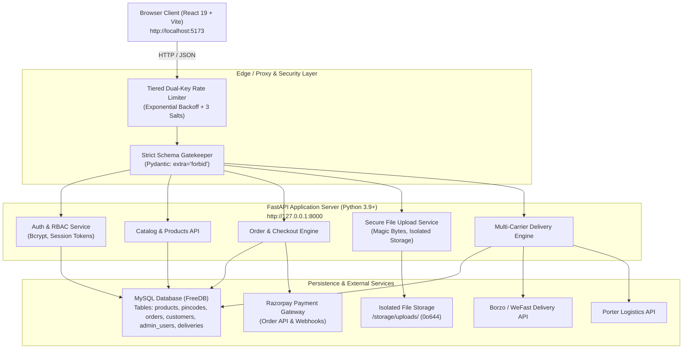
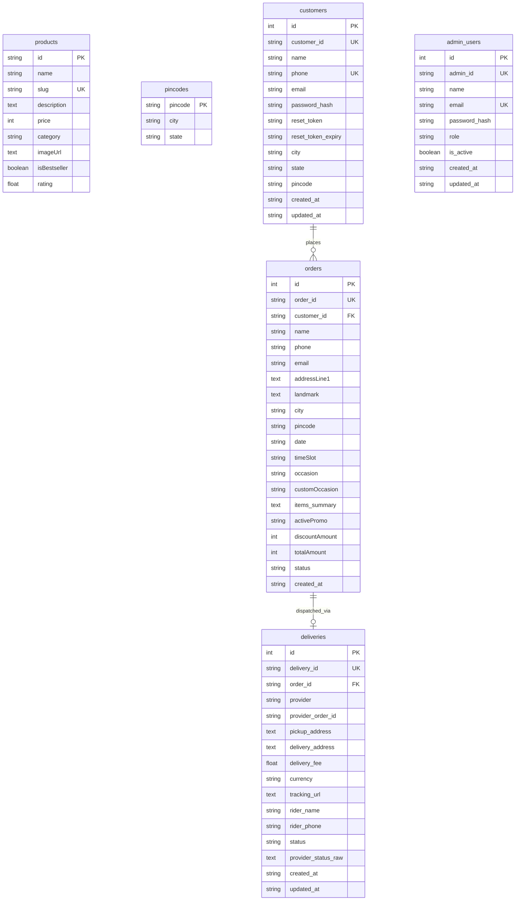

# BloomCakes System Technical Specification

> **Version**: 2.1.0  
> **Status**: Production-Ready  
> **Last Updated**: September 2026  
> **Ecosystem**: Full-Stack Web Application (React 19 + FastAPI + MySQL)

---

## 1. System Overview & Architecture

BloomCakes is an artisanal e-commerce platform and bakery logistics management system. The platform couples a storefront, interactive custom cake builder, and automated checkout with an administrative portal supporting Role-Based Access Control (RBAC), multi-carrier delivery logistics (Borzo, Porter, Manual), payment gateway integration (Razorpay), and security hardening.

### 1.1 Technology Stack Summary

| Layer | Technologies & Frameworks | Key Responsibilities |
| :--- | :--- | :--- |
| **Frontend** | React 19, TypeScript, Vite, TailwindCSS, Lucide Icons | Responsive client application, interactive custom cake configurator, cart, customer account, admin console. |
| **Client State** | TanStack React Query v5, Zustand, React Hook Form, Zod | Asynchronous server-state caching, optimistic UI updates, transient UI state (cart drawers, modals), client-side schema validation. |
| **Backend API** | FastAPI (Python 3.9+), Starlette, Uvicorn, Pydantic v2 | High-performance asynchronous REST API, request validation, authentication, order processing, delivery orchestration. |
| **Data Layer** | SQLAlchemy 2.0 ORM, PyMySQL, MySQL (FreeDB Cloud / Local) | Relational persistence, connection pooling with `NullPool`, indexed queries, foreign keys, transaction rollbacks. |
| **Payments** | Razorpay SDK, Cryptographic HMAC-SHA256 verification | Order creation, payment capture, client signature verification. |
| **Logistics** | Borzo (WeFast) API, Porter Enterprise API, Manual Dispatch | Delivery fee estimation, automatic rider dispatch, order tracking, webhook callbacks. |
| **Security** | Custom Dual-Key Rate Limiter, Bcrypt, Secrets Scanner | Exponential backoff rate limiting, configurable salts, magic-byte upload verification, stack-trace suppression. |
| **Testing** | Playwright (E2E), Vitest, React Testing Library | Full-stack regression tests, multi-server lifecycle automation, unit and component verification. |

### 1.2 System Topology Diagram



---

## 2. Frontend Architecture

### 2.1 Directory Structure

The frontend is organized using a feature-driven modular structure:

```text
src/
├── app/                  # Application bootstrap, routing configuration, global providers
│   └── router/           # React Router declarative routes (Storefront & Admin)
├── assets/               # Static assets, branding graphics, fallbacks
├── components/           # Shared reusable presentation components
│   ├── admin/            # Admin layout, sidebar, filter bars, status badges
│   ├── feedback/         # Toast notifications, alert banners
│   ├── layout/           # Public navigation bar, footer, mobile drawer
│   └── seo/              # Dynamic OpenGraph, Twitter Cards, meta tag helpers
├── config/               # API base URLs, third-party provider configurations
├── features/             # Domain-specific feature modules
│   ├── auth/             # Customer and admin authentication, hooks, tokens
│   ├── cart/             # Shopping cart state, slide-over drawer, price calculation
│   ├── custom-cake/      # Interactive multi-step custom cake design wizard
│   ├── location/         # Pincode validation and delivery availability checker
│   └── products/         # Catalog browsing, filtering, search, and detail views
├── hooks/                # Cross-cutting custom hooks (media queries, local storage)
├── pages/                # Route container screens (Storefront, Cart, Checkout, Admin)
└── store/                # Zustand stores for transient client state
```

### 2.2 Client State & Data Flow Strategy
1. **Server State**: Managed exclusively through **TanStack React Query v5**.
   - Automatic background refetching and caching for products, categories, and pincodes.
   - Query keys are strictly typed (`['products']`, `['product', slug]`, `['admin', 'orders']`).
   - Mutations handle cache invalidation on order placement or product editing.
2. **Client UI State**: Managed using **Zustand**.
   - `useCartStore`: Persists items in local storage, handles quantities, promo codes, and discount calculations.
   - `useLocationStore`: Persists customer's validated delivery pincode and serviceable city.
   - `useAdminAuthStore`: Manages admin session token, role permissions, and active route guard status.

### 2.3 Role-Based Access Control (RBAC)
The administration dashboard implements role-based privilege tiers:

| Role | Permissions |
| :--- | :--- |
| `super_admin` | Full read/write access to analytics, orders, products, deliveries, system settings, and staff user management. |
| `manager` | Order status management, delivery dispatch, and catalog read/write. Cannot modify staff accounts. |
| `delivery_staff` | Access restricted to the `/admin/deliveries` manifest and updating delivery statuses. |
| `catalog_editor` | Access restricted to `/admin/products` for updating pricing, images, and descriptions. |

---

## 3. Backend Architecture & Services

The backend is built with **FastAPI** and runs on ASGI server **Uvicorn**.

### 3.1 Modular Organization

```text
backend/
├── database.py           # SQLAlchemy engine, session maker, connection lifecycle
├── main.py               # API route definitions, exception handlers, middleware
├── models.py             # SQLAlchemy ORM entity definitions
├── rate_limiter.py       # Dual-key rate limiter with exponential backoff & salts
├── requirements.txt      # Pinned Python package dependencies
├── services/             # Third-party integrations (Borzo, Porter, Razorpay)
└── storage/uploads/      # Isolated non-executable media storage directory
```

### 3.2 Payment Gateway Integration
- **Order Creation**: Client calls `POST /api/create-order` with the calculated cart amount in paise. Backend generates a Razorpay Order ID.
- **Verification**: On checkout completion, the frontend provides `razorpay_order_id`, `razorpay_payment_id`, and `razorpay_signature`.
- **Integrity Check**: Backend recalculates `HMAC-SHA256(order_id + "|" + payment_id, RAZORPAY_KEY_SECRET)` and performs constant-time string comparison to verify transaction legitimacy.

### 3.3 Logistics & Multi-Carrier Dispatch Engine
The logistics engine uses a provider strategy pattern supporting three operational modes (`SHIPPING_PROVIDER` environment setting):
1. **Borzo (WeFast)**: Automated API booking for city-wide same-day bike couriers. Generates live tracking URLs.
2. **Porter**: Enterprise API integration for mini-truck / bike delivery dispatches.
3. **Manual Dispatch**: In-house delivery team assignment with internal delivery ID generation.

---

## 4. Database Schema & Data Models

The relational schema is managed through SQLAlchemy ORM mapped to MySQL:



---

## 5. API Endpoints Catalog

### 5.1 Public & Storefront Endpoints

| Method | Endpoint | Rate Limit | Description |
| :--- | :--- | :--- | :--- |
| `GET` | `/health` | None | Service liveness probe. Returns `{"status": "healthy"}`. |
| `GET` | `/products` | Moderate | List all catalog cakes, brownies, and pastries. |
| `GET` | `/products/{slug}` | Moderate | Get single cake item details by URL slug. |
| `GET` | `/pincodes?code={pin}` | Moderate | Query serviceability and city/state for a given 6-digit pincode. |
| `POST` | `/orders` | Loose | Submit new customer order with delivery details. |
| `POST` | `/api/create-order` | Moderate | Create Razorpay payment order for checkout. |
| `POST` | `/api/verify-payment` | Moderate | Cryptographically verify Razorpay payment signature. |

### 5.2 Customer Authentication Endpoints

| Method | Endpoint | Rate Limit | Description |
| :--- | :--- | :--- | :--- |
| `POST` | `/customers/register` | Strict | Create new customer account with hashed password. |
| `POST` | `/customers/login` | Strict | Authenticate customer with email/phone & password. |
| `POST` | `/customers/forgot-password` | Strict | Generate single-use password reset token & email. |
| `GET` | `/customers/verify-reset-token`| Strict | Validate reset token validity & expiry. |
| `POST` | `/customers/reset-password` | Strict | Update password using valid reset token. |
| `GET` | `/customers/{id}/orders` | Loose | Retrieve order history for authenticated customer. |

### 5.3 Administrative & Management Endpoints

| Method | Endpoint | Rate Limit | Description |
| :--- | :--- | :--- | :--- |
| `POST` | `/admin/auth/login` | Strict | Authenticate admin staff; returns session token & role. |
| `GET` | `/admin/analytics` | Loose | Aggregated revenue, customer, and order status counts. |
| `GET` | `/admin/orders` | Loose | Retrieve complete customer orders manifest. |
| `PATCH`| `/orders/{id}/status` | Loose | Update order pipeline status (`order_confirmed`, `dispatched`, etc.). |
| `GET` | `/admin/products` | Loose | Get all catalog products with administration metadata. |
| `POST` | `/admin/products` | Loose | Create new product; auto-generates slug and ID. |
| `PUT` | `/admin/products/{id}` | Loose | Modify existing product attributes and pricing. |
| `DELETE`| `/admin/products/{id}` | Loose | Remove product from catalog. |
| `GET` | `/admin/users` | Loose | List staff accounts (restricted to `super_admin`). |
| `POST` | `/admin/users` | Loose | Create new staff user with designated RBAC role. |
| `PATCH`| `/admin/users/{id}` | Loose | Modify staff user permissions or status. |
| `DELETE`| `/admin/users/{id}` | Loose | Delete staff account (guards against deleting last super admin). |

### 5.4 Logistics & Upload Endpoints

| Method | Endpoint | Rate Limit | Description |
| :--- | :--- | :--- | :--- |
| `POST` | `/api/upload` | Moderate | Secure file upload with magic-byte validation. |
| `GET` | `/api/uploads/{filename}`| Moderate | Serve uploaded file with `nosniff` headers. |
| `POST` | `/admin/orders/{id}/delivery-quote` | Loose | Fetch live courier fare estimate (Borzo/Porter). |
| `POST` | `/admin/orders/{id}/dispatch` | Loose | Dispatch order to carrier service. |
| `GET` | `/admin/orders/{id}/delivery` | Loose | Track live courier status and rider details. |
| `POST` | `/webhooks/delivery/{provider}` | None | Receive courier tracking status webhooks. |

---

## 6. Security Architecture & Hardening Specifications

The application strictly implements defensive controls codified in the workspace's `.agents/skills/security-hardening` skill.

### 6.1 Tiered Rate Limiting & Dual-Key Throttling
- **Configurable Cryptographic Salts**:
  Keys are salted and hashed with SHA-256 before storage:
  - `IP_SALT`: Anonymizes client IP addresses.
  - `ACCOUNT_SALT`: Salts email and phone identifiers.
  - `GLOBAL_SALT`: Salts secondary route keys.
- **Exponential Backoff**:
  Authentication endpoints track consecutive failures:
  $$\text{retry\_after} = \text{base\_delay} \times 2^{(\text{failures} - \text{max\_attempts})}$$
  Returns `429 Too Many Requests` with a `Retry-After: <seconds>` header. Legitimate accounts are never permanently locked.

### 6.2 "Reject, Don't Sanitize" Schema Validation
- All Pydantic request models enforce `model_config = ConfigDict(extra='forbid')` (or `class Config: extra = "forbid"`).
- Requests containing unexpected or injected fields are immediately rejected with `422 Unprocessable Entity`.
- String boundaries (`min_length`, `max_length`), format regex (E.164 phone, RFC 5322 email), and numeric bounds (`gt=0`, `ge=0`) are enforced on every input.

### 6.3 Information Leakage Prevention
- **SQLAlchemy Exception Handler**: Catches all database errors globally. Emits an internal log with full traceback and returns a sanitized JSON response:
  ```json
  {
    "detail": "A database error occurred. Please try again later.",
    "request_id": "c1f7b8d4e92a"
  }
  ```
- **Global Exception Handler**: Intercepts unhandled errors, appends an `X-Request-ID` correlation header, and strips internal paths (`/Users/...`, `/var/www/...`) and tracebacks.

### 6.4 Secure File Upload Pipeline
- **Magic-Byte Content Sniffing**: Inspects the first 2048 bytes of every upload. Validates magic numbers (`\xff\xd8\xff` for JPEG, `\x89PNG\r\n\x1a\n` for PNG, `RIFF...WEBP` for WEBP). Rejects disguised scripts (`shell.png`).
- **File Size Ceiling**: Strictly enforces a 5MB limit during chunked streaming.
- **Isolated Storage**: Files are saved in `storage/uploads/` outside the web root.
- **Execution Prevention**: Uploaded files are assigned `0o644` read-only permissions (non-executable). Files are served with `X-Content-Type-Options: nosniff` and `Content-Security-Policy: default-src 'none'`.

---

## 7. Testing Strategy & Quality Assurance

### 7.1 Automated Test Suites

1. **End-to-End Tests (Playwright)**:
   - Configured in `playwright.config.ts` to automatically orchestrate both the FastAPI backend (`:8000`) and Vite frontend (`:5173`).
   - `e2e/security-hardening.spec.ts`: Tests authentication rate limiting (429), strict schema rejections (422), error leakage prevention, and secure file upload validation.
   - `e2e/admin-rbac.spec.ts`: Tests unauthenticated redirects, super admin login, staff role navigation, and catalog filtering.
   - `e2e/storefront.spec.ts`: Tests home page loading, product catalog navigation, and customer login forms.
2. **Unit & Component Tests (Vitest)**:
   - 24 tests across 12 suites validating cart operations, custom cake state transitions, pricing math, and auth form rendering.

### 7.2 Running Tests Locally

```bash
# Run Vitest Unit Tests
npm run test

# Run Full Playwright E2E Suite
npx playwright test

# Run Security Scanner Script
python3 .agents/skills/security-hardening/scripts/scan_secrets.py

# Run Dependency Audit Script
bash .agents/skills/security-hardening/scripts/audit_dependencies.sh
```

---

## 8. Environment Variables & Deployment Runbook

### 8.1 Backend Environment Configuration (`backend/.env`)

| Variable | Description | Example / Default |
| :--- | :--- | :--- |
| `DATABASE_URL` | SQLAlchemy MySQL connection string | `mysql+pymysql://u:p@host:3306/dbname` |
| `RAZORPAY_KEY_ID` | Razorpay public key ID | `rzp_test_...` |
| `RAZORPAY_KEY_SECRET` | Razorpay private secret | `2Y23w50S...` |
| `SMTP_HOST` | Outgoing email server | `smtp.gmail.com` |
| `SMTP_PORT` | Outgoing email port | `587` |
| `SMTP_USER` | Email address for password resets | `chhotelalpeda@gmail.com` |
| `SMTP_PASSWORD` | App-specific email password | `<app-password>` |
| `FRONTEND_URL` | Client origin URL for reset links | `http://localhost:5173` |
| `SHIPPING_PROVIDER` | Delivery logistics provider | `manual` (or `borzo`, `porter`) |
| `BORZO_API_TOKEN` | Borzo delivery API authorization token | `<token>` |
| `BORZO_API_BASE` | Borzo API endpoint URL | `https://robotapitest.borzodelivery.com` |
| `PORTER_API_KEY` | Porter logistics API key | `<key>` |
| `RATE_LIMIT_STRICT_COUNT` | Max attempts before exponential backoff | `5` |
| `RATE_LIMIT_STRICT_WINDOW` | Rate limit window in seconds | `60` |
| `IP_SALT` | Cryptographic salt for IP anonymization | `<random-hex-string>` |
| `ACCOUNT_SALT` | Cryptographic salt for user accounts | `<random-hex-string>` |
| `GLOBAL_SALT` | Cryptographic salt for route keys | `<random-hex-string>` |

### 8.2 Frontend Environment Configuration (`.env`)

| Variable | Description | Example |
| :--- | :--- | :--- |
| `VITE_API_BASE_URL` | URL of the backend FastAPI server | `http://127.0.0.1:8000` |
| `VITE_RAZORPAY_KEY_ID` | Client-side Razorpay checkout key | `rzp_test_...` |

---

## 9. Default Administrator Credentials

For development and staging environments:
- **Email**: `admin@bloomcakes.co`
- **Password**: `Admin@Bloom123`
- **Role**: `super_admin`
- **Access Route**: `http://localhost:5173/admin/login`
